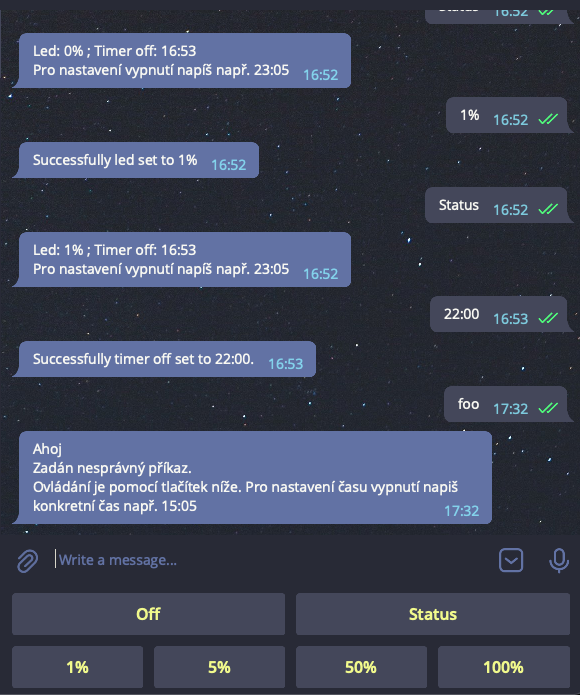

# HomePortal

Control of home devices.

## Dependcies

- [Make password](#login-and-password) file for mqtt.
- Check config file for mqtt at `mqtt_broker/config/mosquitto.conf`.
- Make `.env` file for `monika_bot` at [this section](#monika-bot)

## Develop

- run

```sh
$ docker-compose -f docker-compose.dev.yaml up
```

## Production

- Check path at docker-compose and service files.
- Copy service to systemd and run.

```sh
$ sudo cp home_portal.service /etc/systemd/system
$ sudo systemctl daemon-reload
$ sudo systemctl enable home_portal.service
$ sudo systemctl start home_portal.service
```

## MQTT Broker

### Description

This is a classic [MQTT mosquitto](https://mosquitto.org/) broker hosted on server.

### Login and Password

- After change password file you should restart the container.
- Tips: [http://www.steves-internet-guide.com/mqtt-username-password-example/](http://www.steves-internet-guide.com/mqtt-username-password-example/)
- You can use `mosquitto_passwd` command at the docker like:
  ```sh
  docker exec -it mqtt mosquitto_passwd
  ```

#### Clear file and create new user

```sh
$ mosquitto_passwd -c /mosquitto/config/passwords username
```

#### Delete user from file

```sh
$ mosquitto_passwd -D /mosquitto/config/passwords username
```

#### Add user to file

```sh
$ mosquitto_passwd /mosquitto/config/passwords username
```

## Monika bot

This is telegram bot for controll [monika`s led bed.](https://github.com/vichi99/MicroPython/tree/master/led_bed)

### dependencies

```sh
$ cp monika_bot/.env_example monika_bot/.env
```

-
